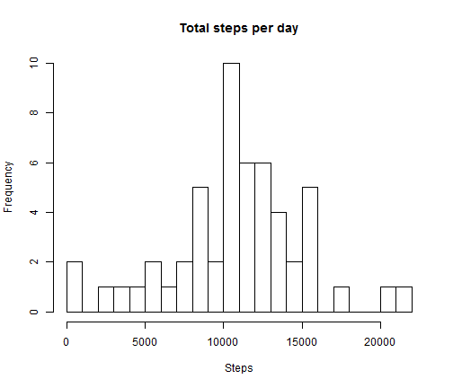
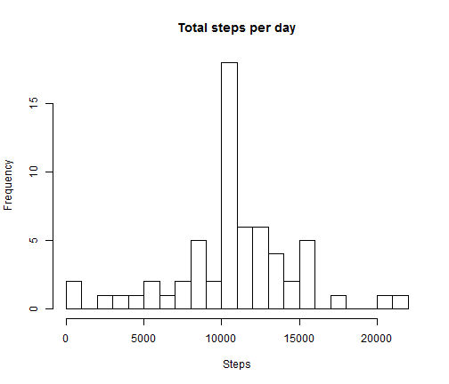

Title: Reproducible Research Project 1
========================================================
###JV 2015-01-18

## Introduction 


### Background
It is now possible to collect a large amount of data about personal movement using activity monitoring devices such as a Fitbit, Nike Fuelband, or Jawbone Up. These type of devices are part of the ???quantified self??? movement ??? a group of enthusiasts who take measurements about themselves regularly to improve their health, to find patterns in their behavior, or because they are tech geeks. But these data remain under-utilized both because the raw data are hard to obtain and there is a lack of statistical methods and software for processing and interpreting the data.

This assignment makes use of data from a personal activity monitoring device. This device collects data at 5 minute intervals through out the day. The data consists of two months of data from an anonymous individual collected during the months of October and November, 2012 and include the number of steps taken in 5 minute intervals each day.


### Purpose of this document
This document will answer the questions as posed in Reproducible Research Project 1 from JHSPH Data science course.
Namely
  * What is mean total number of steps taken per day?
  * What is the average daily activity pattern?
  * What are the effects of inputting missing values?
  * Are there differences in activity patterns between weekdays and weekends?

## Setting global environment

```r
setwd("C:/JHSPH - Data Science/Repro Research/Assignment1")
library(data.table)
library(ggplot2)
library(knitr)

# create a class of type customDate to use when importing data
# this class allows us to convert from character to date via setAs fn
setClass("customDate")
setAs("character", "customDate", function(from) as.Date(from, format="%Y-%m-%d"))
```

## Load Data

```r
#import data
datafile <- read.table("activity.csv", colClasses = c("numeric","customDate", "numeric"),
                       sep=',', header=TRUE, na.strings="NA")
head(datafile)
```

```
##   steps       date interval
## 1    NA 2012-10-01        0
## 2    NA 2012-10-01        5
## 3    NA 2012-10-01       10
## 4    NA 2012-10-01       15
## 5    NA 2012-10-01       20
## 6    NA 2012-10-01       25
```

## Q1: What is mean total number of steps taken per day? 

#### 1.1 Make a histogram of the total number of steps taken each day

```r
hist(tapply(datafile$steps, datafile$date, sum), xlab = "Steps", breaks = 20, 
     main = "Total steps per day")
```

 

#### 1.2 Calculate and report the mean and median total number of steps taken per day
As can be seen from below the mean number of steps per day is 10766 while the median is 10765                                              

```r
#Calculate and report the mean and median total number of steps taken per day
totalDailySteps <- as.numeric(tapply(datafile$steps, datafile$date, sum))
stepsMean <- mean(totalDailySteps, na.rm = TRUE)
stepsMedian <- median(totalDailySteps, na.rm = TRUE)

details <- c("   Mean number of steps per day" = stepsMean, "   Median number of steps per day" = stepsMedian)
details
```

```
##      Mean number of steps per day    Median number of steps per day 
##                             10766                             10765
```

## Q2: What is the average daily activity pattern? 

#### 2.1 Make a time series plot of the 5-minute interval (x-axis) and the average number of steps taken, averaged across all days (y-axis)


```r
intervalSteps <- aggregate(datafile$steps,by = list(interval = datafile$interval),
                                FUN=mean, na.rm=TRUE)
colnames(intervalSteps) <- c("interval", "steps")
#head(intervalSteps)
plot(intervalSteps$interval, intervalSteps$steps, type = "l", main = "Average steps 5-minute interval", 
     ylab = "Average steps", xlab = "Time of day", xaxt = "n")
labels <- c("00:00", "05:00", "10:00", "15:00", "20:00")
labels.at <- seq(0, 2000, 500)
axis(side = 1, at = labels.at, labels = labels)
```

 

#### 2.2 Which 5-minute interval, on average across all the days in the dataset, contains the maximum number of steps?
As can be seen fron below interval 835 has, on average the highest number of steps

```r
max_interval <- intervalSteps[which.max(intervalSteps$steps),]
max_interval
```

```
##     interval steps
## 104      835 206.2
```

## Q3 - Missing Values

#### 3.1 Calculate and report the total number of missing values in the dataset
As can be seen from below there are a total of 2304 missing values in the dataset

```r
#Calculate and report the total number of missing values in the dataset
totalNAs <- sum(is.na(datafile$steps))
totalNAs
```

```
## [1] 2304
```

#### 3.2 Devise a strategy for filling in all of the missing values in the dataset.
The strategy we will use in this case is to replace NAs with the average value from that interval.


```r
fillNAs <- function(data, pervalue) {
  na_index <- which(is.na(data$steps))
  na_replace <- unlist(lapply(na_index, FUN=function(idx){
    interval = data[idx,]$interval
    pervalue[pervalue$interval == interval,]$steps
  }))
  fill_steps <- data$steps
  fill_steps[na_index] <- na_replace
  fill_steps
}

datafileNoNAs <- data.frame(  
  steps = fillNAs(datafile, intervalSteps),  
  date = datafile$date,  
  interval = datafile$interval)
```

Next we prove that no more NAs exist in the new dataset

```r
sum(is.na(datafileNoNAs$steps))
```

```
## [1] 0
```

#### 3.3 Make a histogram of the total number of steps taken each day


```r
# Make a histogram of the total number of steps taken each day
hist(tapply(datafileNoNAs$steps, datafileNoNAs$date, sum), xlab = "Steps", breaks = 20, 
     main = "Total steps per day")
```

 

#### 3.4 Calculate and report the mean and median total number of steps taken per day. Do these values differ from the estimates from the first part of the assignment? What is the impact of imputing missing data on the estimates of the total daily number of steps?

As can be seen from the below when the missing values are filled in then the foloowing occurs
  * Mean and median are now equal 
  * While there is some movement in the summary data (particulary in the 1st & 3rd quartiles) this change is relativley small and does not skew the overall data


```r
#Calculate and report the mean and median total number of steps taken per day.
totalDailyStepsNoNAs <- as.numeric(tapply(datafileNoNAs$steps, datafileNoNAs$date, sum))
stepsNoNAsMean <- mean(totalDailyStepsNoNAs)
stepsNoNAsMedian <- median(totalDailyStepsNoNAs)

#Do these values differ from the estimates from the first part of the assignment
comparison <- c("   With NAs Mean" = stepsMean, "   No NAs Mean" = stepsNoNAsMean,
                "   With NAs Median" = stepsMedian, "   No NAs Median" = stepsNoNAsMedian)
comparison
```

```
##      With NAs Mean        No NAs Mean    With NAs Median 
##              10766              10766              10765 
##      No NAs Median 
##              10766
```

```r
differences <- c(summary(na.omit(totalDailySteps)),summary(totalDailyStepsNoNAs))
differences
```

```
##    Min. 1st Qu.  Median    Mean 3rd Qu.    Max.    Min. 1st Qu.  Median 
##      41    8840   10800   10800   13300   21200      41    9820   10800 
##    Mean 3rd Qu.    Max. 
##   10800   12800   21200
```

## Q4 - Are there differences in activity patterns between weekdays and weekends?

#### 4.1 Create a new factor variable in the dataset with two levels ??? ???weekday??? and ???weekend??? indicating whether a given date is a weekday or weekend day.


```r
#Create a new factor variable in the dataset with two levels
datafileNoNAs$dayofWeek <- weekdays(datafileNoNAs$date)
datafileNoNAs$isWeekend <- as.numeric(datafileNoNAs$dayofWeek %in% c('Saturday', 'Sunday'))
datafileNoNAs$dayType <- factor(datafileNoNAs$isWeekend, levels=c(0,1), labels=c('Weekday', 'Weekend'))
head(datafileNoNAs)
```

```
##     steps       date interval dayofWeek isWeekend dayType
## 1 1.71698 2012-10-01        0    Monday         0 Weekday
## 2 0.33962 2012-10-01        5    Monday         0 Weekday
## 3 0.13208 2012-10-01       10    Monday         0 Weekday
## 4 0.15094 2012-10-01       15    Monday         0 Weekday
## 5 0.07547 2012-10-01       20    Monday         0 Weekday
## 6 2.09434 2012-10-01       25    Monday         0 Weekday
```

#### 4.2 Make a panel plot containing a time series plot (i.e. type = "l") of the 5-minute interval (x-axis) and the average number of steps taken, averaged across all weekday days or weekend days (y-axis).


```r
#aggregate into by day Type
intervalAveragesbyDayType <- aggregate(datafileNoNAs$steps, 
                          list(interval = as.numeric(as.character(datafileNoNAs$interval)), 
                               dayType = datafileNoNAs$dayType),
                          FUN = "mean")

ggplot(intervalAveragesbyDayType, aes(x=interval, y=x)) + 
  geom_line(color="#336699") + 
  facet_wrap(~ dayType, nrow=2, ncol=1) + 
  labs(main="Num steps per interval ", x="Interval", y="Number of steps") 
```

 

As can be see from the above the number of steps spikes earlier in the day for a weekday before reducing significantly while at weekends the appears to be more of an even spread of number of steps throughout the day.
However when we run some basic exploratory data analysis on these we can see that although there are profile differences the overall amount of walking is essentially equal for both day types.


```r
d <- subset(datafileNoNAs, steps >= 1)
by(d$steps, d$dayType, summary)
```

```
## d$dayType: Weekday
##    Min. 1st Qu.  Median    Mean 3rd Qu.    Max. 
##       1      23      46     106      95     806 
## -------------------------------------------------------- 
## d$dayType: Weekend
##    Min. 1st Qu.  Median    Mean 3rd Qu.    Max. 
##     1.0    26.0    50.8   111.0   109.0   785.0
```

```r
boxplot(steps~dayType, data=d, col=(c("lightblue","lightgreen")),
        main="Steps per Interval", xlab="Day Type")
```

 


